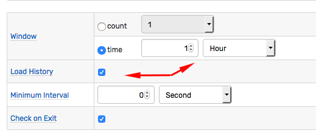

# Window

## Overview

A window is an in-memory structure created by the rule engine for each unique combination of metric, entity, and grouping tags extracted from incoming commands.

Windows are displayed on the **Alerts > Rule Windows** page.

## Window Length

### Count Based Windows

Count-based windows accumulate up to the specified number of samples. Samples are sorted in **order of arrival**, with the most recently received sample placed at the end of the array. When the window is full, the first (oldest by arrival time) sample is removed from the window to free up space at the end of the array for an incoming sample.

### Time Based Windows

Time-based windows store samples received within the specified time interval. The number of samples in such windows is not limited.

The start of the interval is initially set to current time minus the window length, and is constantly incremented as the time passes, these windows are sometimes referred to as _sliding_ windows. If the timestamp of the incoming command is equal to or greater than the window start time, the command is added to the window.

> The **end** time in time-based windows is not set (in particular, it is not set to current time) and the window will accept commands with future timestamps unless they are to be discarded with the [Time filter](filters.md#time-filter) or [filter expression](filters.md#filter-expression) such as `timestamp <= now.getMillis() + 60000`.

Old commands are automatically removed from the window once their timestamp is earlier than the defined window start time.

## Window Status

Response actions are triggered on window status changes.

As new data is received and old data is removed from the window, the rule engine re-evaluates the condition which can cause the status of the current window to change, triggering response actions.

### Initial Status

New windows are created based on incoming data, no historical data is loaded from the database unless the 'Load History' setting is turned on.

The window for the given [grouping](grouping.md) key is created when the first matching command is received by the rule engine.

The new windows are assigned initial status of `CANCEL` which is then updated based on the results of the boolean (`true` or `false`) condition.

### Triggers

Response actions can be triggered whenever the window changes its status as well as at scheduled intervals when the status is `REPEAT`. Triggers for each action type are configured and executed separately.

### Status Events

| Previous State | New Status | Previous Condition Value | New Condition Value | Trigger Supported |
| --- | --- | --- | --- | --- |
| `CANCEL` | `OPEN` | `false` | `true` | Yes |
| `OPEN`  | `REPEAT` | `true` | `true` | Yes |
| `REPEAT` | `REPEAT` | `true` | `true` | Yes |
| `OPEN` | `CANCEL` | `true` | `false` | Yes |
| `REPEAT` | `CANCEL` | `true` | `false` | Yes |
| `CANCEL` | `CANCEL` | `false` | `false` | No |

### `OPEN` Status

`OPEN` status is assigned to the window when the condition changes value from `false` to `true`.

### `REPEAT` Status

`REPEAT` status is assigned to an `OPEN` window when the following sequential condition is evaluated as `true` and retains this status for all subsequent `true` evaluations. The minimum number of evaluations that must have been performed on any window for it to have the `REPEAT` status is two consecutive `true` evaluations.

When the window is in `REPEAT` status, actions can be executed with the frequency specified in the rule editor based on a certain number of evaluations, for example.

### `CANCEL` Status

`CANCEL` is the initial status assigned to new windows. It is also assigned to the window when the condition changes from `true` to `false` or when the window is destroyed on rule modification.

Windows in `CANCEL` status do not trigger _repeat_ actions upon subsequent `false` evaluations. Such behavior can be emulated by creating a rule with a negated expression which returns `true` instead of `false` for the same condition.

A window may assume the `CANCEL` status when the condition changes from `true` to `false` as well as when the rule is modified, deleted, or the database is orderly shutdown. `On Cancel` triggers are not invoked, even if enabled, when the rule is modified/deleted or in case of shutdown.  This behavior is controlled with `cancel.on.rule.change` server property.

## Lifecycle

When the rule is deleted or modified with the rule editor, all windows for the given rule are dropped. The windows are re-created when the new matching commands are received by the database.

Newly created windows contain only **new commands**, unless 'Load History' setting is enabled. Such windows load historical values received over the same interval as the window duration, or the same number of commands as the window length.

## Timers

The condition is re-evaluated each time a new matching command is added to the window or removed from it.

To evaluate the rule on schedule, regardless of external commands, create rules based on the following **timer** metrics:

* `timer_15s` - Command is received every 15 seconds.
* `timer_1m` - Command is received every 1 minute.
* `timer_15m` - Command is received every 15 minutes.
* `timer_1h` - Command is received every 1 hour.

These metrics are produced by the built-in database scheduler and are always available.

## Window Fields

Windows expose a set of continuously updated [window fields](window-fields.md) which can be included in the [condition](condition.md) expression, the [filter](filters.md) expression and user-defined [variables](variables.md).
