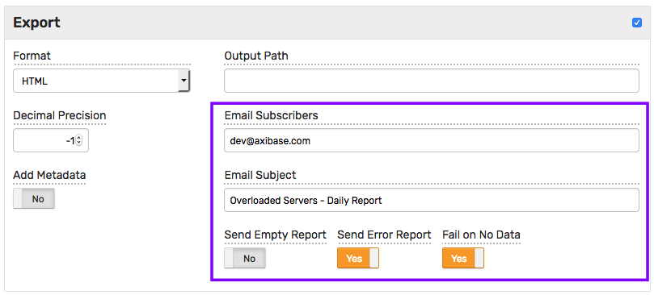

# SQL Scheduler

## Overview

SQL Scheduler provides a way to create reports from query results which can be distributed via email, written to a file system, and published as links accessible over HTTP.

In addition, it allows to [store query results](scheduled-sql-store.md) back in the database as calculated metrics.

## Sample Configuration


## Query

The scheduler executes a `SELECT` [query](README.md) on schedule.

## Schedule

Scheduling frequency is controlled with the `Schedule` field containing a [`cron` expression](scheduled-sql-cron.md) that determines when the task should be executed.

## Authorization

Scheduled queries are executed with **All Entities: Read** permission. No records are excluded from the result set unlike ad-hoc queries, which are filtered based on the user's [entity read permissions](../administration/user-authorization.md#entity-permissions).

## Formats

* CSV
* Excel (xlsx)
* HTML
* JSON

CSV files can be optionally archived with zip or gzip compression.

HTML format is optimized for compatibility with common desktop and email clients.

### Sample Reports

* [sql-report.csv](examples/sql-report.csv)
* [sql-report.json](examples/sql-report.json)
* [sql-report.xlsx](examples/sql-report.xlsx)
* [sql-report.html](examples/sql-report.html)

## Decimal Precision

To round numeric values, set decimal precision to the desired number of fractional digits.

* `0` means that no fractional digits will be displayed.
* `-1` means that no rounding will be applied and numbers will be displayed with their original precision.

## Export Options

The report file can be written to a file on the local file system, sent to email subscribers, or published as a link.

### File System

To store reports on a disk, enable the **Export** section by clicking on the header and specify an output path.


Specify the absolute path including the file name.

If the parent directory in the specified path does not exist, it will be created automatically.
The file extension should match the export format, if the format is EXCEL the Output Path should end with ".xlsx".

The **Output Path** field may contain date and form [placeholders](#placeholders) so that files or their parent directories are grouped by day or month.

Example: `/opt/report/daily/${yyyy-MM-dd}.csv`

An expression like `/opt/report/daily/${yyyy-MM-dd}.csv` creates the following file `/opt/report/daily/2017-06-10.csv` when executed.

### Email Delivery

To distribute report files via email, enable the **Export** section, specify an email subject and one or multiple email addresses, separated by comma or space.

The `Email Subject` field supports date and form [placeholders](#placeholders), for example `${name} on ${yyyy-MM-dd}`.



`Send Empty Report` and `Send Error Report` settings control whether a report should be emailed in case of an empty result or error.

`Send Empty Report` option in particular, when disabled, can be used for alert purposes whereby a report is sent only if the result set is not empty.

```sql
SELECT entity AS "Server", entity.tags.app AS "Application",
  ROUND(AVG(value), 1) AS "Average CPU Used, %"
FROM "cpu_busy"
  WHERE datetime >= previous_day AND datetime < current_day
GROUP BY entity
  HAVING AVG(value) > 50
```

In the above example, the query relies on the `HAVING` clause to find servers with high CPU utilization. The report with unchecked `Send Empty Report` option will be sent only if at least one server with high CPU usage is found.

`Fail on No Data` causes an error if the query finds no matching records in the database which maybe indicative of a breakdown in data collection.

### Publishing

To make a report available for download by end-users, enable the **Publish** section. The report will contain rows that were prepared by the server when the task was last executed.


To allow users to download the updated results each time they click on the link, enable the `Allow Refresh` option.

When enabled and if the url contains a `?refresh=true` parameter, the report is rebuilt by the database for each download request.

```
https://atsd_host:8443.co/sqlr/85/cpu-busy-total-query.csv?refresh=true
```

To make links accessible for unauthenticated users, enable the `Guest Access` option. Additional download links for non-authenticated users will be displayed.


### Placeholders

Placeholders can be included in the `Output Path` and `Email Subject` fields.

#### Date placeholder

The date placeholder may include the following calendar units:

- `yyyy` - 4-digit year
- `yy` - 2-digit year
- `MM` - 2-digit numeric month
- `MMM` - 3-letter month, for example 'Jan'
- `dd` - day of month
- `HH` - hour of the day in 24-hour format
- `ss` - seconds
- `SSS` - milliseconds

Examples:

- `${yyyy-MM-dd}`
- `${yyyy/MM/dd}`
- `${yyyy-MM-dd-HH-mm-ss.SSS}`

A date placeholder will be evaluated **after** the query is completed.

#### Form placeholders

Form placeholders return an empty string if the requested field is not found or contains no text.

- `${name}` - Report name as specified in the 'Name' field.
- `${author}` - Report author as specified in the 'Author' field.
- `${description}` - Report description as specified in the 'Description' field.
- `${id}` - Report numeric identifier.
- `${link}` - Report URL based on `server.url` setting, for example `https://atsd_host:8443/export/queries/query.xhtml?queryId=23`

## Metadata

Exported files can optionally include [metadata fields](scheduled-sql-metadata.md) describing the data in the report.

## Store Results

The **Store** option in the query configuration allows [storing results](scheduled-sql-store.md) of the query back into the database as new series.
