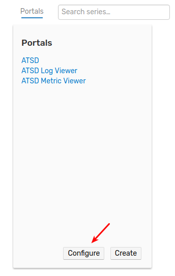
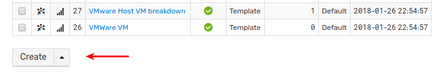
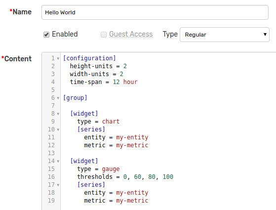
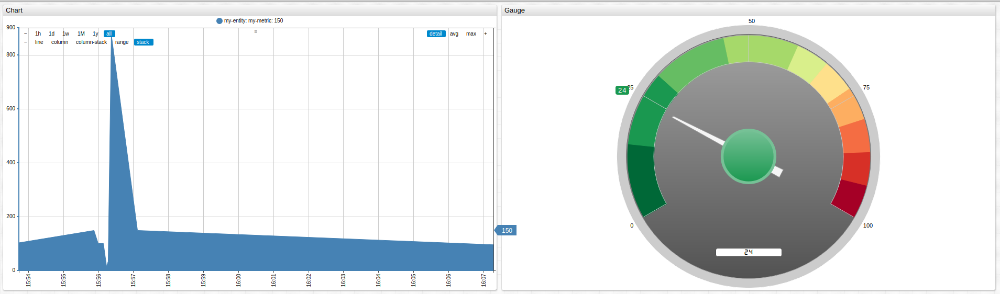

# Getting Started: Part 2

### Create Portal

* Click on **Portals** link in the top menu.
  
  

* Click on **Create**.

  
  
* Copy the following configuration into the **Content** area: 

    ```ls
    [configuration]
      height-units = 2
      width-units = 2
      time-span = 12 hour
    
    [group]
    
      [widget]
        type = chart
        [series]
          entity = my-entity
          metric = my-metric
    
      [widget]
        type = gauge
        thresholds = 0, 60, 80, 100
        [series]
          entity = my-entity
          metric = my-metric
    ```

* Enter a portal name. 
* Press **Save**.

    

The above configuration defines two widgets: a linear time chart and a gauge.

To view the portal, click on **View By Id** or **View By Name**.



Review the [basic syntax](https://axibase.com/products/axibase-time-series-database/visualization/widgets/selecting-series/) used to select series.

Refer to [visualization documentation](https://axibase.com/products/axibase-time-series-database/visualization/) to add more widgets to the portal.

[Continue to Next Page](getting-started-3.md).
