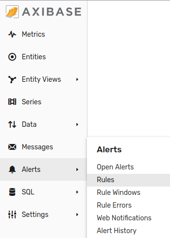
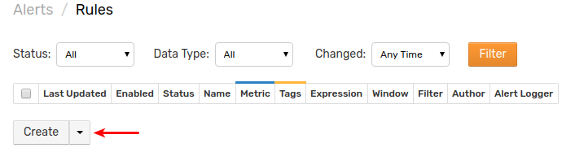
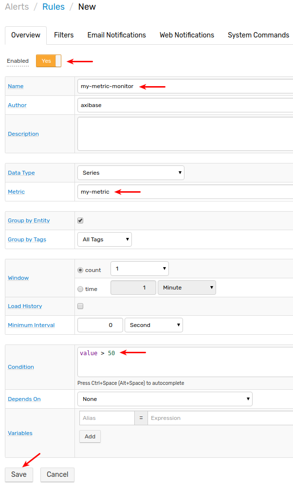
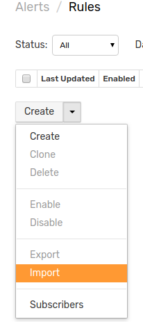
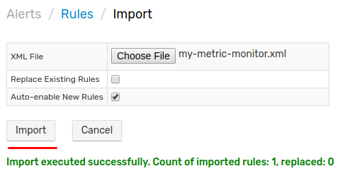
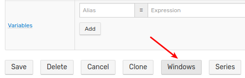
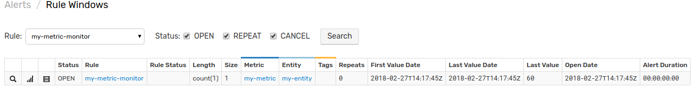
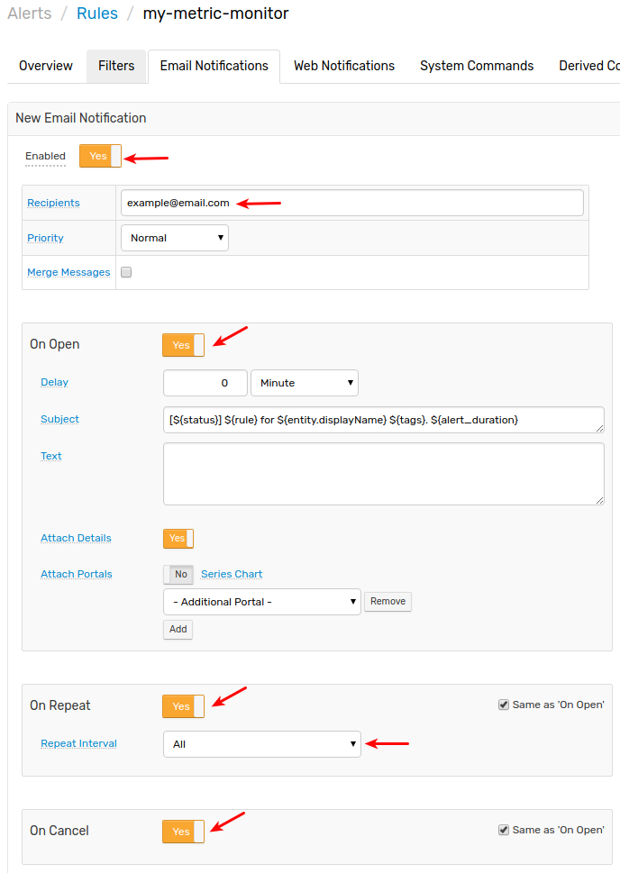

# Getting Started: Part 4

## Alerts

Open the **Alerts > Rules** page and click on **Create** to configure an alert rule for `my-entity` and `my-metric` using the built-in [Rule Engine](../rule-engine).





The following expression will raise an alert if the last value is greater than 50:

```java
value > 50
```



Create the rule manually or import [my-metric-monitor.xml](resources/my-metric-monitor.xml) file by selecting _Import_ on the **Alerts > Rules** page.





> Make sure that 'Discard Out-of-Order Values' option is **disabled** on the **Filters** tab.

Return to **Data Entry** page and submit a new value greater than 50.

Click on **Windows** button at the rule editor page to review the recently opened alert.





Update Time field value to a later timestamp and insert a value smaller than 50. Verify that the alert was deleted.

To receive alert notifications via email, configure the [mail client](../administration/mail-client.md) which is accessible at the **Settings > Mail Client** page and specify notification rule on the **Email Notifications** tab in the rule editor.



[Continue to Next Page](getting-started-5.md).