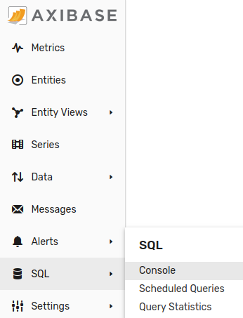
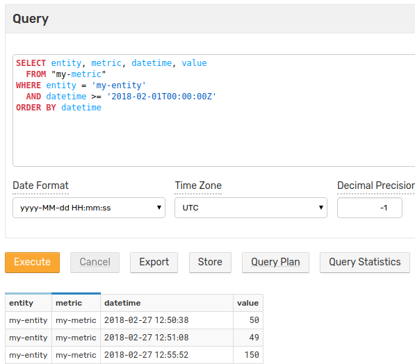
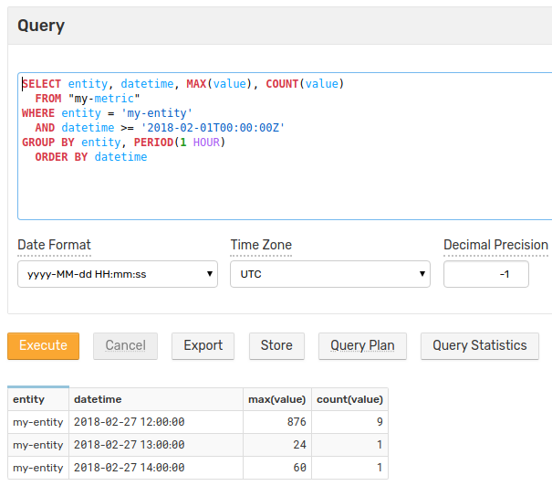

# Getting Started: Part 5

### SQL

Open the SQL console:



Enter the following query, adjust datetime:

```sql
SELECT entity, metric, datetime, value
  FROM "my-metric"
WHERE entity = 'my-entity'
  AND datetime >= '2018-02-01T00:00:00Z'
ORDER BY datetime
```



Modify the query to add aggregation and groupings:

```sql
SELECT entity, datetime, MAX(value), COUNT(value)
  FROM "my-metric"
WHERE entity = 'my-entity'
  AND datetime >= '2018-02-01T00:00:00Z'
GROUP BY entity, PERIOD(1 HOUR)
  ORDER BY datetime
```



Review the [SQL syntax](../sql/README.md) and experiment by executing your own queries.

### Summary

Congratulations! You have reached the end of the Getting Started introduction to Axibase Time Series Database.
