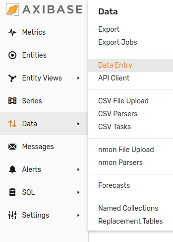
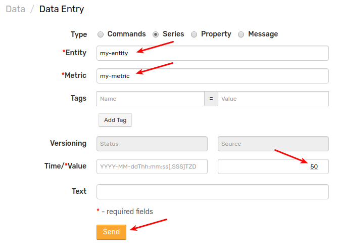
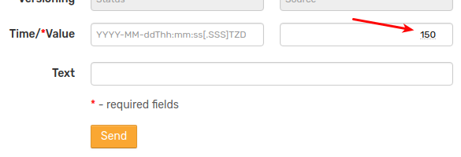

# Getting Started: Part 1

The purpose of this article is to guide the reader through the first steps of using Axibase Time Series Database.

### Prerequisites

* [Install Axibase Time Series Database.](../installation/README.md)
* Login into the ATSD web interface at `https://atsd_host:8443/`

### Insert Data Manually

Open the **Data Entry** form located under the **Data** tab in the main menu.



Select type **Series**



Fill out the **Entity**, **Metric**, and **Value** fields, press **Send**:

```elm
metric = my-metric
entity = my-entity
value = 24
```

> By default the Time field is set to the current server time and is displayed in [ISO 8601 format](https://en.wikipedia.org/wiki/ISO_8601).

> We will ignore series tags to simplify this example. Tags can be used to add [metadata about the time series.](https://axibase.com/products/axibase-time-series-database/data-model/)

Insert additional observations by modifying **Value** field for example sample.



### Graph Data

Open a time chart using the following link `https://atsd_host:8443/portals/series?entity=my-entity&metric=my-metric`.

In the upper right corner switch to _detail_ data type to view the detailed values you inserted in the previous step.

Click _all_ in the timespan control to view all data instead of the last 24 hours.


Spend a moment learning the basic [time chart controls](http://axibase.com/products/axibase-time-series-database/visualization/widgets/time-chart/).

[Continue to Next Page](getting-started-2.md).
