# Versioning

Versioning enables tracking of time-series value changes for the purpose of audit trail and data reconciliation. 

The capability is required for vertical applications such as Energy Data Management.

## Versioning Fields

Once enabled, the database tracks changes made to stored values with the following versioning fields:

| Field Name | Description | 
| --- | --- | 
|  Version Time  |  Timestamp when insert command was received. Set automatically by ATSD server with millisecond precision.  | 
|  Version Source  |  User-defined field to track sources (origins) of change events such as username, device id, or IP address. <br>Set to `user:{username}` by default for changes made through the [web interface](#updating-series-value).| 
|  Version Status  |  User-defined field to classify change events. <br> Set to 'invalid' for `NaN` and out of range values by default if **Invalid Value Action = `SET_VERSION_STATUS`** | 

> The ability to specify custom fields with server-side business logic such as change locking, is under development.

## Enabling Versioning

Versioning is **disabled** by default. 

It can be enabled for specific metrics via [Meta API](../api/meta/metric/update.md), by setting the **Versioning** drop-down to 'Yes' in the multi-record editor, or by enabling **Versioning** on the Metric Editor page:

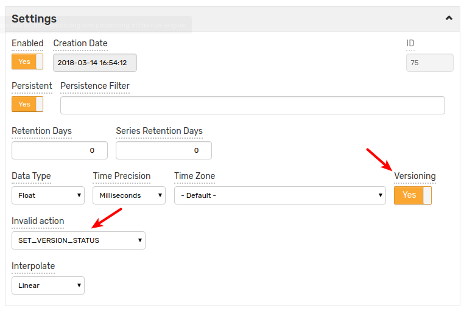

In addition, **Invalid Value Action** may be set to `SET_VERSION_STATUS` to initialize the _Version Status_ field with an 'invalid' value if the inserted sample is not a valid number or is outside of the specified minimum and maximum bounds.

## Inserting Version Fields

To insert versioning fields along with the modified value, use the reserved tags:

 * `$version_source`
 * `$version_status`

These tags will be converted to the corresponding [versioning fields](#versioning-fields). Note that `$version_status` tag overrides 'invalid' value set by `SET_VERSION_STATUS` trigger. 

Options to insert versioned series:

* [Network Commands](#network-commands)
* [Data Entry Series form](#data-entry-form)
* [CSV Parser using Default Tags](#csv-parser-using-default-tags)
* [CSV Parser using Renamed Columns](#csv-parser-using-renamed-columns)

### Network Commands

To insert versioned samples, use the [series](../api/network/series.md) command with the version tags:

```ls
  series e:{entity} m:{metric}={number} t:$version_status={status} t:$version_source={source} d:{iso-date}
```

> Note:
> * Request to insert versioned value for a **non-versioned** metric will cause a validation error.
> * If the command refers to a new metric, it will be automatically created with **Versioning** set to **Yes**.

Example:

```ls
series e:e-vers m:m-vers=13 t:$version_status=OK t:$version_source=collector-1 d:2018-03-20T15:25:40Z
```

### Data Entry Form

Versioned samples can be added by opening **Data > Data Entry > Series** form and specifying versioning tags:

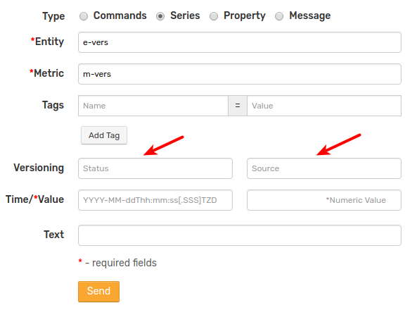

> Note: _Metric_ field must reference an existing metric with _Versioning = Yes_ 

### CSV Parser using Default Tags

To apply the same versioning fields to all records in a CSV file, specify them in the **Default Tags** field in the CSV parser or on the [CSV File Upload](../parsers/csv#uploading-csv-files-into-axibase-time-series-database) page:

```ls
$version_status={status}
$version_source={source}
```
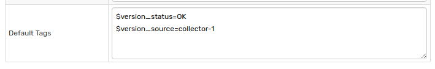

> Note:
> * Request to insert versioned value for a **non-versioned** metric will cause a validation error.
> * If the command refers to a new metric, it will be automatically created with **Versioning** set to **Yes**.

### CSV Parser using Renamed Columns

To extract versioning fields from CSV content, add the version tags to the **Tag Columns** field and specify mappings between the original column names and version tag names in the **Renamed Columns** field.

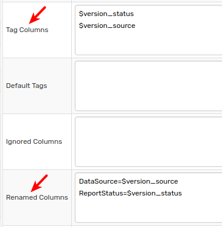


> Note:
> * Request to insert versioned value for a **non-versioned** metric will cause a validation error.
> * If the command refers to a new metric, it will be automatically created with **Versioning** set to **Yes**.

## View Versions

Version history can be retrieved on the [Ad-hoc Export](../reporting/ad-hoc-exporting.md) page or via a scheduled [Export Job](../reporting/scheduled-exporting.md).

### Ad-hoc Export page

Open the **Filters** section and enable **Display Versions** setting on export page:

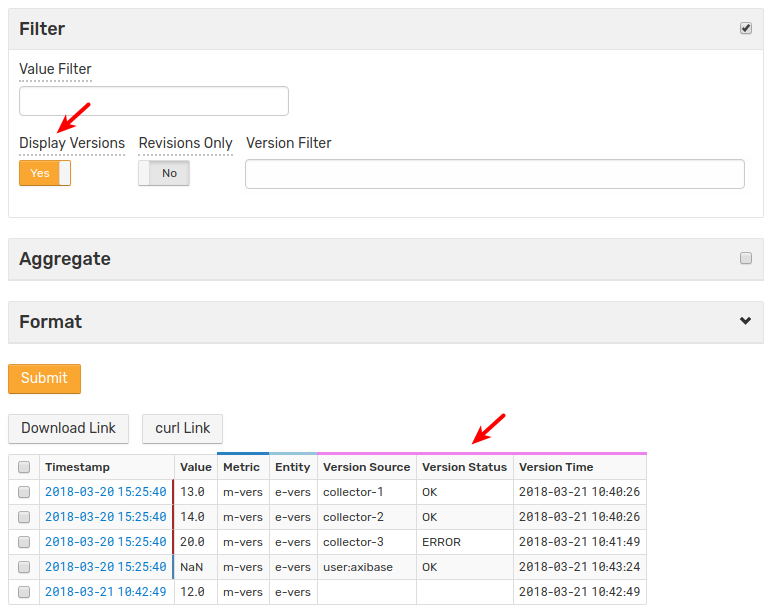

- Records with version history are highlighted with _blue_ and _brown_-colored borders: _blue_ border represents the latest value, _brown_ border represents a historical, overwritten value.
- `NaN` represents deleted values. 
- Aggregation functions and other calculations ignore historical and deleted values.

#### Version Filters

|**Name**|**Description**|
|---|---|
|**Revisions Only** |Displays only modified values.|
|**Version Filter**| An expression to filter version history.<br>The expression may contain the `version_source`, `version_status` and `version_time` fields.<br>The `version_time` field supports [calendar](../shared/calendar.md) syntax using the `date()` function.<br> The `version_source` and `version_status` fields support wildcards.<br> To view the deleted values use `Double.isNaN(value)` method in the [Value Filter](../reporting/ad-hoc-exporting.md#ad-hoc-export-settings) field.|

Examples:

* Match using wildcards

```ls
    version_source LIKE 'col*'
```
    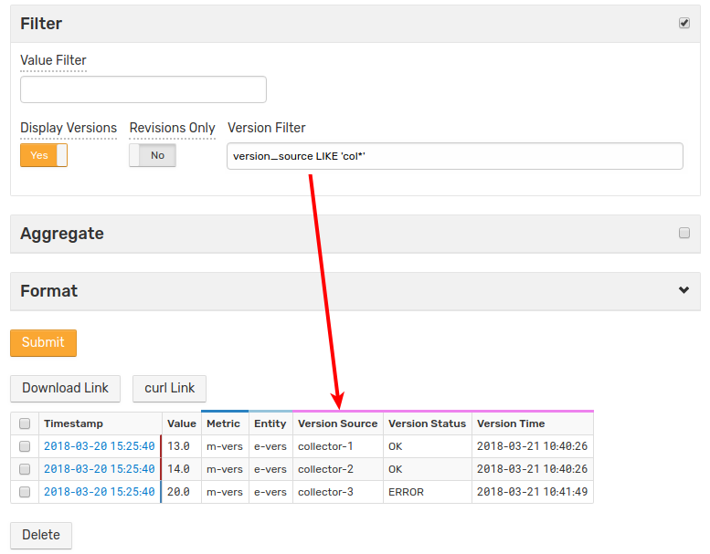

* Match using date function

```ls
    version_time > date('2018-03-21 10:41:00') AND version_time < date('now')
```
    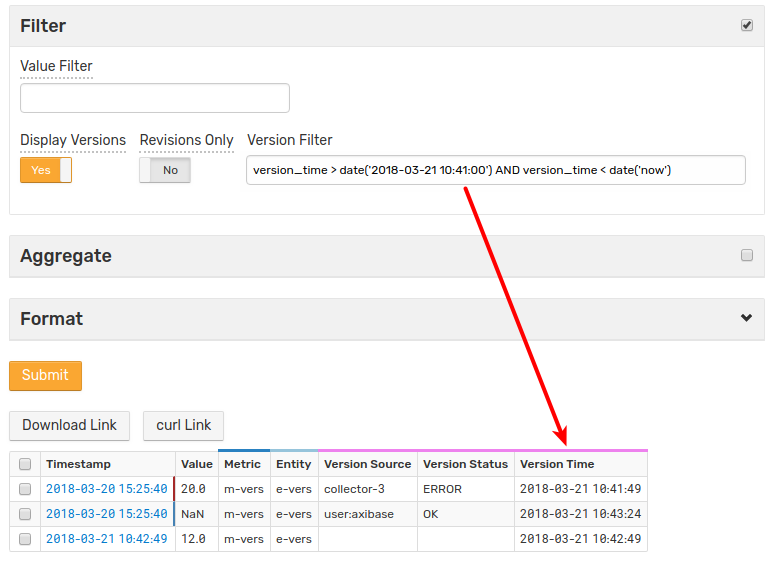
    
* Match using exact value

```ls 
    version_status = 'OK'
```
    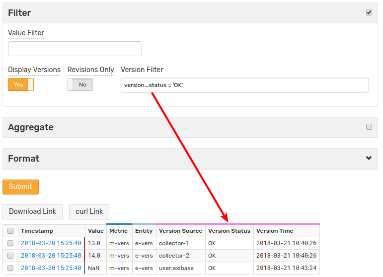
    
* Display only modified values

    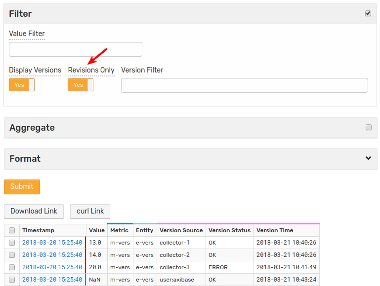

## Modifying Values

Create a report in HTML format on the [Ad-hoc Export](../reporting/ad-hoc-exporting.md) page with versioning mode enabled.

Click on timestamp for the selected record to open the **Data Entry** page.


Change version _Status_ and _Source_, change the `Value` and click **Update**.

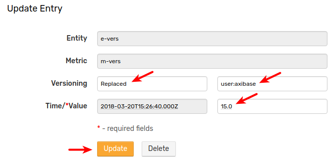

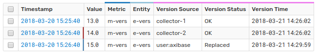

## Deleting Values

Create a report in HTML format on the [Ad-hoc Export](../reporting/ad-hoc-exporting.md) page with versioning mode enabled.

Click the timestamp for the selected record to open the **Data Entry** page.


Change version _Status_ and _Source_, change the `Value` and click **Delete**.

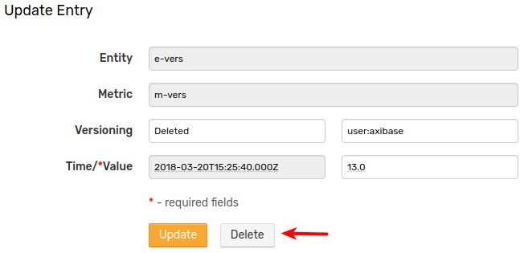

Note that the value will not actually be deleted. Rather, the current value for the selected timestamp will be replaced with a `NaN` marker.

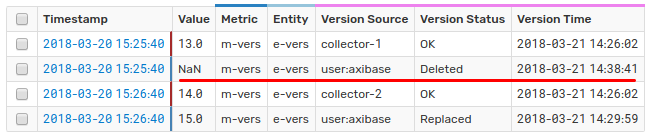

A value can also be deleted using the selection checkbox and **Delete** button on the export page.

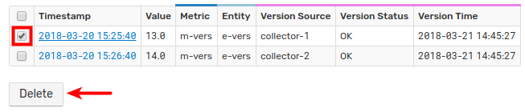

### Deleting Multiple Series Values

To delete multiple values, set the flags in the checkboxes for all desired rows or select all with the uppermost checkbox. Click **Delete**.

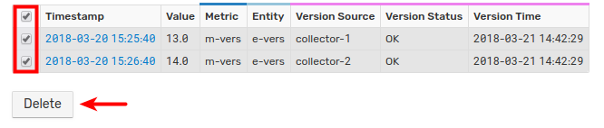
